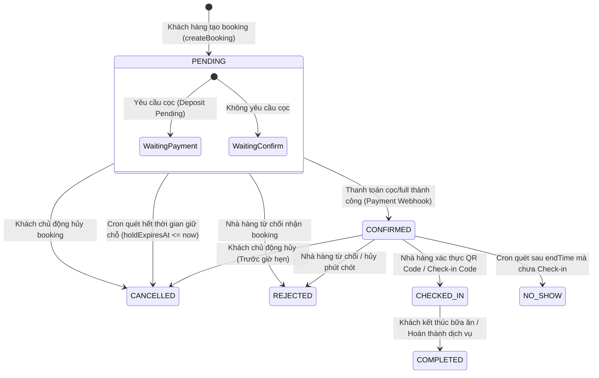
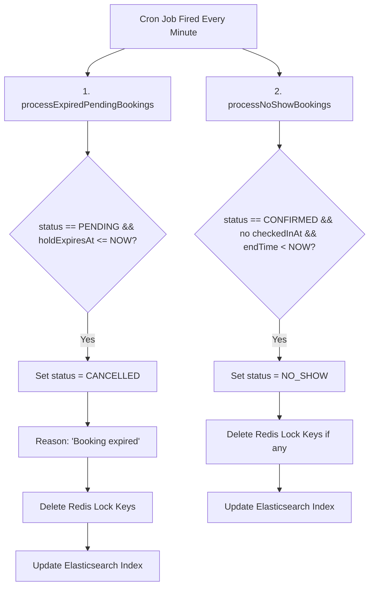

# Hướng Dẫn Chi Tiết Workflow Booking Hệ Thống TableBooking

Tài liệu này mô tả chi tiết toàn bộ luồng hoạt động, xử lý nghiệp vụ, chuyển đổi trạng thái và các tiến trình Cron tự động của module Booking trong hệ thống **TableBooking**.

---

## 1. Sơ Đồ Tổng Quan Trạng Thái (Booking Lifecycle & State Transitions)

### 1.1 Sơ đồ luồng trạng thái chính (Main Flow)



---

## 2. Bảng Định Nghĩa Các Trạng Thái (Enums & Statuses)

Hệ thống quản lý Booking thông qua 3 nhóm trạng thái độc lập được định nghĩa tại [`booking.schema.ts`](file:///d:/Git/TableBooking/backend/src/modules/bookings/schemas/booking.schema.ts):

### 2.1 BookingStatus (Trạng thái đơn đặt bàn)
| Trạng thái | Mô tả | Chi tiết kích hoạt |
| :--- | :--- | :--- |
| **`PENDING`** | Đang chờ xử lý / Thanh toán cọc | Khởi tạo khi khách hoàn tất form đặt bàn. Đặt bàn ở trạng thái này được giữ chỗ tạm thời (Redis Hold). |
| **`CONFIRMED`** | Đã xác nhận thành công | Kích hoạt khi khách thanh toán xong tiền cọc (hoặc toàn bộ) qua cổng thanh toán. Hệ thống sinh mã QR & mã check-in. |
| **`CHECKED_IN`** | Khách đã đến nhà hàng | Kích hoạt khi nhà hàng quét mã QR (`checkInToken`) hoặc nhập mã thủ công (`checkInCode`). |
| **`COMPLETED`** | Hoàn thành dịch vụ | Trạng thái cuối cùng khi khách sử dụng xong bữa ăn. Cho phép khách gửi Đánh giá (Review). |
| **`CANCELLED`** | Đã hủy | Do khách chủ động hủy, hoặc do tiến trình **Cron** tự động hủy khi hết hạn thanh toán cọc (`holdExpiresAt`). |
| **`REJECTED`** | Nhà hàng từ chối | Chủ nhà hàng từ chối đơn (do hết bàn ngoài thực tế, đóng cửa đột xuất,...). Tiền cọc sẽ được hoàn lại. |
| **`NO_SHOW`** | Khách không đến | Tiến trình **Cron** tự động đánh dấu khi qua khung giờ kết thúc đặt bàn (`endTime`) mà khách chưa check-in. |

### 2.2 DepositStatus (Trạng thái đặt cọc)
* **`NOT_REQUIRED`**: Nhà hàng / khung giờ này không yêu cầu đặt cọc.
* **`PENDING`**: Đang chờ khách thanh toán tiền cọc trong khoảng thời gian quy định.
* **`PAID`**: Tiền cọc đã thanh toán thành công.
* **`REFUNDED`**: Đã hoàn trả tiền cọc cho khách (do hủy đúng hạn hoặc nhà hàng từ chối).
* **`FORFEITED`**: Khách bị tịch thu/mất tiền cọc (do hủy sát giờ < 120 phút).

### 2.3 PaymentStatus (Trạng thái thanh toán)
* **`UNPAID`**: Chưa thanh toán.
* **`PARTIAL`**: Đã thanh toán một phần (tiền cọc).
* **`PAID`**: Đã thanh toán 100% tổng đơn đặt bàn.
* **`REFUNDED`**: Đã hoàn tiền giao dịch.

---

## 3. Quy Trình Đặt Bàn Chi Tiết Từ A - Z (Booking Flow Breakdown)

Luồng xử lý đặt bàn trải qua 6 giai đoạn chính:

```text
[1. Chọn Bàn & Khung Giờ] ──► [2. Validation & Khóa Redis] ──► [3. Tạo Booking PENDING]
                                                                        │
[6. Check-in & Hoàn thành] ◄── [5. Thanh Toán & Xác Nhận] ◄──────────────┘
```

### Bước 1: Kiểm Tra Lịch Hoạt Động & Khả Dụng (Availability & Capacity Validation)
Khi người dùng gọi `POST /bookings/:restaurantId` (Xử lý tại [`BookingsService.createBooking`](file:///d:/Git/TableBooking/backend/src/modules/bookings/bookings.service.ts#L318)):

1. **Kiểm tra thông tin nhà hàng**: Nhà hàng phải đang hoạt động (`isAcceptingBookings = true`).
2. **Kiểm tra thời gian đặt trước**:
   * Ngày đặt bàn không vượt quá số ngày đặt trước tối đa (`advanceBookingDays`, mặc định 30 ngày).
   * Thời điểm bắt đầu phải thỏa mãn thời gian báo trước tối thiểu (`minBookingNoticeMinutes`, mặc định 60 phút).
3. **Tính toán thời gian kết thúc (`endTime`)**:
   * Tính dựa trên thời lượng đặt bàn mặc định của nhà hàng (`defaultReservationDurationMinutes`, mặc định 120 phút).
4. **Kiểm tra sức chứa bàn (`Capacity Check`)**:
   * Tổng `capacity` của danh sách bàn được chọn (`dto.tableIds`) phải $\ge$ số lượng khách (`dto.guestCount`).
5. **Kiểm tra lịch cấu hình (`validateTableAvailability`)**:
   * Kiểm tra trong collection `TableAvailability`. Bàn phải hoạt động trong khung giờ requested theo Lịch tuần (`weeklySlots`) hoặc không bị chặn theo Ngoại lệ (`exceptions`).

---

### Bước 2: Cơ Chế Khóa Bàn Tạm Thời Chống Trùng Lịch (Redis Lock & Hold TTL)

Để tránh trường hợp hai người dùng cùng đặt một bàn tại một thời điểm (Race Condition / Double Booking):

1. **Kiểm tra trùng lịch trong MongoDB (`validateBookingConflict`)**:
   Hệ thống truy vấn các booking hiện có của bàn trong cùng ngày có thời gian đè lên nhau (`startTime < requestedEndTime` AND `endTime > requestedStartTime`) ở các trạng thái:
   * `depositStatus = PAID` và status thuộc `[PENDING, CONFIRMED, CHECKED_IN]`
   * `depositStatus = PENDING` và `paymentStatus = UNPAID` và `holdExpiresAt > now`
   * `depositStatus = NOT_REQUIRED` và status thuộc `[CONFIRMED, CHECKED_IN]`

2. **Tạo Lock Distributed trên Redis (`acquireBookingTableLocks`)**:
   * Cú pháp Redis Key khóa giữ chỗ ([`booking-hold-key.util.ts`](file:///d:/Git/TableBooking/backend/src/helpers/redis/booking-hold-key.util.ts)):
     ```text
     booking:hold:{restaurantId}:{tableId}:{YYYY-MM-DD}:{startTime}:{endTime}
     ```
   * Thời gian sống (TTL): Tính theo thời hạn nộp cọc (`depositPaymentTimeoutMinutes`, mặc định 30 phút).
   * Thực hiện lệnh `SETNX` (Set if Not Exists) vào Redis. Nếu bàn đã bị giữ bởi request khác, hệ thống quăng lỗi `ConflictException`.
   * **Rollback Safety**: Nếu khóa bàn thứ $N$ thất bại, hệ thống tự động xóa tất cả các lock key đã acquire trước đó.

---

### Bước 3: Tính Giá & Đặt Cọc (Pricing Rules & Deposit Calculation)

1. Gọi [`PricingRuleService.previewBookingPricing`](file:///d:/Git/TableBooking/backend/src/modules/pricing-rule/pricing-rule.service.ts):
   * Áp dụng các quy tắc giảm giá/tăng giá theo khung giờ cao điểm, ngày lễ.
   * Tính toán khoản tiền cọc cần trả (`depositAmount`) và ảnh hưởng đến `depositStatus` (`PENDING` hoặc `NOT_REQUIRED`).
2. Xác định mốc hết hạn giữ chỗ `holdExpiresAt = now + depositPaymentTimeoutMinutes` (nếu cần cọc).

---

### Bước 4: Khởi Tạo Booking (State: `PENDING`)

1. Lưu document Booking mới vào MongoDB với status `PENDING`, lưu trữ `pricingSnapshot`, `tableDeposits`.
2. Đồng bộ dữ liệu sang **Elasticsearch** qua [`RestaurantBookingSearchService.index`](file:///d:/Git/TableBooking/backend/src/modules/bookings/booking-restaurant-search.service.ts).
3. Trả về thông tin Booking cho frontend kèm cờ `payDepositNow`.

---

### Bước 5: Thanh Toán & Xác Nhận Booking (State: `CONFIRMED`)

1. Khách hàng thực hiện thanh toán cọc qua VNPay hoặc cổng thanh toán tích hợp trong module Payment ([`PaymentService`](file:///d:/Git/TableBooking/backend/src/modules/payment/payment.service.ts)).
2. Khi cổng thanh toán gọi lại Webhook/IPN thành công ([`handleSuccessfulPayment`](file:///d:/Git/TableBooking/backend/src/modules/payment/payment.service.ts#L524)):
   * Đổi `depositStatus` $\rightarrow$ `PAID`.
   * Đổi `paymentStatus` $\rightarrow$ `PARTIAL` (nếu cọc) hoặc `PAID` (nếu trả đủ 100%).
   * Đổi `status` $\rightarrow$ **`CONFIRMED`**, cập nhật `confirmedAt = now`.
   * **Sinh mã Check-in tự động** qua helper [`assignCheckInCredentials`](file:///d:/Git/TableBooking/backend/src/helpers/checkin.helper.ts):
     * `checkInToken`: Chuỗi ngẫu nhiên Hex 64 ký tự (dùng cho Mã QR).
     * `checkInCode`: Chuỗi định dạng `TBK-XXXX` (dùng cho nhập thủ công).

---

### Bước 6: Check-in & Sử Dụng Dịch Vụ (State: `CHECKED_IN` $\rightarrow$ `COMPLETED`)

1. **Xác thực mã Check-in**:
   * Khi khách đến nhà hàng, nhân viên dùng thiết bị quét mã QR hoặc nhập `checkInCode`.
   * Endpoint `POST /bookings/check-in/verify` gọi [`BookingsService.verifyCheckInBooking`](file:///d:/Git/TableBooking/backend/src/modules/bookings/bookings.service.ts#L1716) để tra cứu thông tin booking.
2. **Thực hiện Check-in**:
   * Endpoint `POST /bookings/:bookingId/check-in` gọi [`BookingsService.checkInBooking`](file:///d:/Git/TableBooking/backend/src/modules/bookings/bookings.service.ts#L1793).
   * Chuyển `status` $\rightarrow$ **`CHECKED_IN`**, cập nhật `checkedInAt = now`.
   * Đồng bộ lại Elasticsearch index.
3. **Hoàn thành Booking**:
   * Sau khi khách hoàn tất dịch vụ, trạng thái chuyển sang **`COMPLETED`**.
   * Chỉ các booking ở trạng thái `COMPLETED` mới được quyền gửi đánh giá (Review & Rating) cho nhà hàng.

---

## 4. Xử Lý Hủy & Từ Chối Booking (Cancellation & Rejection Logic)

### 4.1 Khách Chủ Động Hủy (`cancelBooking`)
Được xử lý tại [`BookingsService.cancelBooking`](file:///d:/Git/TableBooking/backend/src/modules/bookings/bookings.service.ts#L1394) với **MongoDB Transaction**:

* **Điều kiện hủy**: Booking phải ở trạng thái `PENDING` hoặc `CONFIRMED` và chưa đến giờ đặt bàn.
* **Quy tắc hoàn tiền cọc (`REFUND_LIMIT_MINUTES = 120 phút`)**:
  * **Hủy trước $\ge$ 120 phút**: Đủ điều kiện hoàn tiền (`shouldRefund = true`). Tiền cọc được hoàn lại qua `paymentService.refundBooking`, `depositStatus` chuyển thành `REFUNDED`, `paymentStatus` $\rightarrow$ `REFUNDED`.
  * **Hủy sát giờ (< 120 phút)**: Không hoàn tiền cọc. Tiền cọc bị tịch thu, `depositStatus` chuyển thành **`FORFEITED`**.
* **Giải phóng nguyên tài nguyên**:
  * Đổi `status` $\rightarrow$ `CANCELLED`.
  * Xóa ngay lập tức các Redis Hold Key của bàn.
  * Cập nhật chỉ mục Elasticsearch.

### 4.2 Nhà Hàng Từ Chối (`rejectBooking`)
Được xử lý tại [`BookingsService.rejectBooking`](file:///d:/Git/TableBooking/backend/src/modules/bookings/bookings.service.ts#L1564) với **MongoDB Transaction**:

* **Điều kiện**: Nhà hàng có thể từ chối đơn ở trạng thái `PENDING` hoặc `CONFIRMED` trước giờ hẹn.
* **Chính sách hoàn tiền**: **Tự động hoàn tiền 100%** cho khách hàng (`shouldRefund = true` nếu khách đã trả tiền).
* **Cập nhật hệ thống**:
  * Đổi `status` $\rightarrow$ `REJECTED`, ghi nhận `rejectionReason`.
  * Đổi `depositStatus` $\rightarrow$ `REFUNDED`, `paymentStatus` $\rightarrow$ `REFUNDED`.
  * Xóa lập tức Redis Hold Key và cập nhật Elasticsearch.

---

## 5. Tiến Trình Tự Động CRON SCHEDULER (Booking Status Cron)

Nhà hệ thống sử dụng `@nestjs/schedule` để quản lý và tự động cập nhật trạng thái đơn đặt bàn theo thời gian thực. Tiến trình được định nghĩa tại [`BookingStatusScheduler`](file:///d:/Git/TableBooking/backend/src/modules/bookings/schedulers/booking-status.scheduler.ts).

### 5.1 Cấu Hình Lịch Chạy
```typescript
@Cron(CronExpression.EVERY_MINUTE)
async handleBookingStatus() { ... }
```
* **Tần suất**: Chạy **MỖI PHÚT** một lần (`* * * * *`).



---

### 5.2 Tác Vụ 1: Tự Động Hủy Booking Hết Hạn Giữ Chỗ (`processExpiredPendingBookings`)

* **Hàm thực thi**: [`BookingsService.processExpiredPendingBookings`](file:///d:/Git/TableBooking/backend/src/modules/bookings/bookings.service.ts#L1850)
* **Điều kiện quét**:
  ```javascript
  {
    status: BookingStatus.PENDING,
    holdExpiresAt: { $lte: new Date() }
  }
  ```
* **Hành động xử lý**:
  1. Đổi `status` $\rightarrow$ **`CANCELLED`**.
  2. Ghi nhận `cancelledAt = now` và `cancelReason = 'Booking expired'`.
  3. Duyệt danh sách `tableIds`, gọi `redisService.delete(holdKey)` để **giải phóng ngay lập tức các bàn đang giữ chỗ** cho khách khác đặt.
  4. Cập nhật lại Elasticsearch document.

---

### 5.3 Tác Vụ 2: Tự Động Xử Lý Vắng Mặt NO-SHOW (`processNoShowBookings`)

* **Hàm thực thi**: [`BookingsService.processNoShowBookings`](file:///d:/Git/TableBooking/backend/src/modules/bookings/bookings.service.ts#L1904)
* **Điều kiện quét**:
  ```javascript
  {
    status: BookingStatus.CONFIRMED,
    checkedInAt: { $exists: false }
  }
  ```
* **Hành động xử lý**:
  1. Tính toán thời điểm kết thúc khung giờ đặt bàn `endDateTime = combineBookingDateAndTime(bookingDate, endTime)`.
  2. So sánh với thời gian hiện tại (`now`): Nếu `endDateTime < now` (nghĩa là đã quá giờ kết thúc đặt bàn mà khách vẫn chưa đến làm thủ tục check-in).
  3. Đổi `status` $\rightarrow$ **`NO_SHOW`**.
  4. Xóa Redis hold key (nếu còn tồn tại).
  5. Cập nhật chỉ mục Elasticsearch.

---

## 6. Tổng Kết Các Quy Tắc Nghiệp Vụ Quan Trọng (Business Rules Summary)

1. **Chống trùng giờ (Double Booking Protection)**: Kết hợp kiểm tra query tầng DB MongoDB + Khóa giữ chỗ Distributed Lock tầng Redis (`SETNX` với TTL).
2. **Quy tắc thời gian đặt**:
   * Không được đặt thời gian trong quá quá khứ.
   * Phải đặt trước thời gian báo trước tối thiểu (`minBookingNoticeMinutes`).
   * Không được đặt vượt quá giới hạn ngày đặt trước (`advanceBookingDays`).
3. **Quy tắc hoàn cọc khi hủy**:
   * Hủy trước giờ hẹn $\ge 120$ phút $\rightarrow$ Hoàn $100\%$ cọc.
   * Hủy trước giờ hẹn $< 120$ phút $\rightarrow$ Mất $100\%$ cọc (`FORFEITED`).
   * Nhà hàng chủ động từ chối $\rightarrow$ Luôn hoàn $100\%$ tiền cọc cho khách.
4. **Quy tắc Check-in & Đánh giá**:
   * Mã Check-in QR (`checkInToken`) & Text (`checkInCode`) được tự động sinh ngay khi booking chuyển sang `CONFIRMED`.
   * Chỉ booking ở trạng thái `CHECKED_IN` mới có thể gửi Đánh giá (Review) cho nhà hàng.
