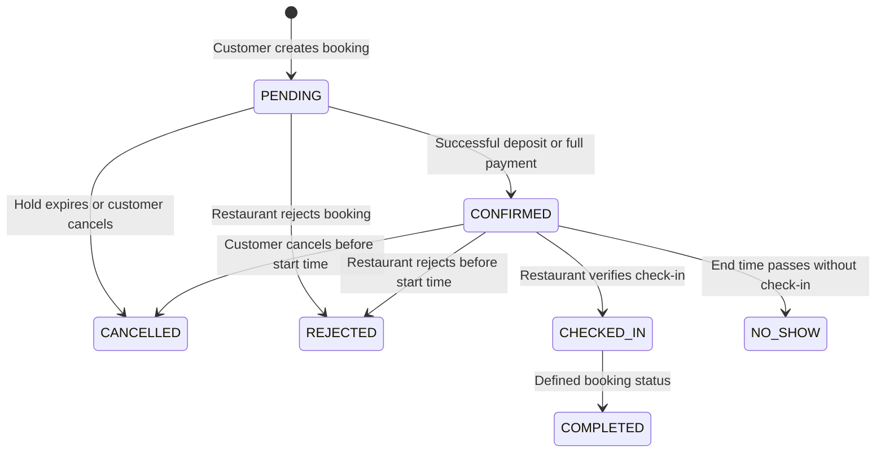

# TableBooking Booking Workflow

This document describes the booking lifecycle, payment and deposit handling, availability validation, concurrency protection, and scheduled status processing implemented by the TableBooking backend.

## 1. Booking Lifecycle



`COMPLETED` is part of the booking status model, but the current booking controller does not expose a completion operation. The implemented transitions are primarily `PENDING`/`CONFIRMED` through payment, cancellation, rejection, check-in, and scheduled no-show processing.

## 2. Statuses

### Booking status

| Status       | Meaning                                                                                                            |
| ------------ | ------------------------------------------------------------------------------------------------------------------ |
| `PENDING`    | Booking has been created and is awaiting the next applicable action, including payment when a deposit is required. |
| `CONFIRMED`  | Deposit or full payment has been processed successfully.                                                           |
| `CHECKED_IN` | The restaurant has verified the booking at arrival.                                                                |
| `COMPLETED`  | Booking status defined for a completed service.                                                                    |
| `CANCELLED`  | Booking was cancelled by the customer or automatically after an expired hold.                                      |
| `REJECTED`   | The restaurant rejected the booking.                                                                               |
| `NO_SHOW`    | The booking reached its end time without check-in.                                                                 |

### Deposit status

- `NOT_REQUIRED`: No deposit is required for the selected tables and pricing rules.
- `PENDING`: A deposit is required and has not yet been paid.
- `PAID`: The deposit was paid successfully.
- `REFUNDED`: A paid deposit was refunded.
- `FORFEITED`: A deposit was not refunded under the cancellation rules.

### Payment status

- `UNPAID`: No payment has been recorded.
- `PARTIAL`: The deposit was paid, but the full booking amount was not paid.
- `PAID`: The full amount was paid.
- `REFUNDED`: A paid transaction was refunded.

## 3. Booking Creation

Creating a booking requires an authenticated customer to provide a restaurant, booking date, start time, guest count, and at least one table. The backend then:

1. Confirms that the restaurant exists and accepts bookings.
2. Applies the restaurant booking limits:
    - `advanceBookingDays`, default `30` days.
    - `minBookingNoticeMinutes`, default `60` minutes.
    - `defaultReservationDurationMinutes`, default `120` minutes.
3. Calculates `endTime` from the start time and reservation duration.
4. Confirms that the selected tables belong to the restaurant, are `AVAILABLE`, and have enough total capacity.
5. Validates the configured table availability schedule for the weekday or date-specific exception.
6. Checks overlapping bookings in MongoDB.
7. Calculates the price, adjustments, and deposit requirement through the pricing rules service.
8. Creates the booking with status `PENDING`, payment status `UNPAID`, and a pricing snapshot.

The customer can request deposit payment immediately. The created booking response includes `payDepositNow`, allowing the frontend to continue to the checkout flow when requested.

## 4. Availability and Double-Booking Protection

The system uses multiple checks to prevent invalid or conflicting reservations.

### Table availability

Tables must be configured in `TableAvailability` and must be active during the requested interval. Weekly slots and date-specific exceptions are supported. Closed exceptions make the tables unavailable for that date. A selected table must also have status `AVAILABLE` and contribute enough capacity for the requested guest count.

### MongoDB conflict checking

The backend treats overlapping bookings as conflicts when their time ranges overlap (`existing start < requested end` and `existing end > requested start`) and they match one of these conditions:

- Deposit is `PAID` and booking status is `PENDING`, `CONFIRMED`, or `CHECKED_IN`.
- Deposit is `PENDING`, payment is `UNPAID`, status is `PENDING`, and `holdExpiresAt` is still in the future.
- Deposit is `NOT_REQUIRED` and booking status is `CONFIRMED` or `CHECKED_IN`.

### Redis holds

When a deposit is required, the backend creates a Redis hold for each selected table using `SET NX` with an expiration time. The hold key has this shape:

```text
booking:hold:{restaurantId}:{tableId}:{YYYY-MM-DD}:{startTime}-{endTime}
```

The hold duration is based on `depositPaymentTimeoutMinutes`, default `30` minutes. If acquiring a lock fails for one table, previously acquired locks are released. Holds are also released after cancellation, rejection, expiration, or no-show processing.

Bookings that do not require a deposit do not create a deposit-payment hold during creation.

## 5. Pricing and Payment

The pricing service applies active restaurant pricing rules and stores a pricing snapshot with the booking. It calculates the final price, table-level deposits, adjustments, and `depositStatus`.

Payments use VNPAY in test mode. The backend creates a payment transaction and VNPAY payment URL for either a deposit or full payment. The VNPAY IPN handler verifies the signature and amount before processing the result.

On a successful deposit payment:

- Payment transaction becomes paid.
- `depositStatus` becomes `PAID`.
- `paymentStatus` becomes `PARTIAL`.
- Booking status becomes `CONFIRMED`.

On a successful full payment:

- Payment transaction becomes paid.
- A pending deposit becomes `PAID` when applicable.
- `paymentStatus` becomes `PAID`.
- Booking status becomes `CONFIRMED`.

Both successful paths set `confirmedAt` and generate the booking check-in credentials. A failed VNPAY result is recorded as a failed payment transaction and does not confirm the booking.

## 6. Cancellation and Rejection

### Customer cancellation

Only the booking owner can cancel a booking. Cancellation is allowed for `PENDING` and `CONFIRMED` bookings before the booking start time.

The refund threshold is **120 minutes before the booking start time**:

- At least 120 minutes before start: a paid transaction is refunded, and the payment/deposit statuses are updated to `REFUNDED`.
- Less than 120 minutes before start: a paid deposit becomes `FORFEITED`.
- An unpaid pending deposit also becomes `FORFEITED` when the booking is cancelled.

The booking becomes `CANCELLED`, its hold expiration is cleared, Redis holds are released, and the Elasticsearch booking document is updated.

### Restaurant rejection

The restaurant that owns the booking can reject `PENDING` or `CONFIRMED` bookings before the start time. The rejection reason is stored. If the booking has a paid deposit or payment, the backend requests a refund and updates the corresponding statuses to `REFUNDED`. Redis holds are released and Elasticsearch is updated.

Rejection is not the same as confirmation: the restaurant does not manually change `PENDING` to `CONFIRMED`; successful payment performs that transition.

## 7. Check-in and No-show Processing

The restaurant or an administrator can verify a booking using its check-in token or check-in code. A valid `CONFIRMED` booking can then be changed to `CHECKED_IN`.

The booking scheduler runs every minute:

1. It changes `PENDING` bookings whose `holdExpiresAt` has passed to `CANCELLED`, releases their Redis holds, updates Elasticsearch, and sends expiration notifications.
2. It checks `CONFIRMED` bookings without `checkedInAt`. When the booking end time has passed, it changes them to `NO_SHOW`, releases any remaining holds, updates Elasticsearch, and sends no-show notifications.

## 8. Elasticsearch and Notifications

Booking-related Elasticsearch documents are synchronized when relevant booking state changes occur. The backend also provides a restaurant/admin reindex operation.

Booking, payment, expiration, rejection, cancellation, check-in, and no-show events create in-app notifications. Notifications are delivered to authenticated user-specific Socket.IO rooms, and users can list, filter by unread state, count, mark, and delete notifications.

## 9. Business Rules Summary

1. A booking must use restaurant-owned, `AVAILABLE` tables with sufficient capacity.
2. The requested time must fit the configured weekly schedule or date exception.
3. Booking dates and notice periods are constrained by restaurant settings.
4. MongoDB overlap checks and Redis `SET NX` holds protect against double booking.
5. Successful VNPAY payment, rather than manual restaurant approval, confirms a booking.
6. Customer cancellation refunds paid transactions only when at least 120 minutes remain before the start time.
7. Restaurant rejection before the start time refunds paid transactions.
8. Confirmed bookings without check-in become `NO_SHOW` after their end time.
