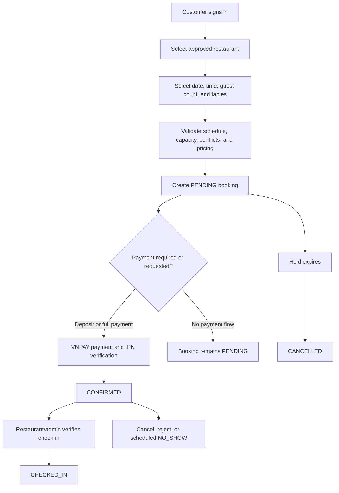

# TableBooking Business Logic

TableBooking is a restaurant discovery and table reservation system with four user contexts: unauthenticated visitors, customers, restaurant owners, and administrators. Authentication, role checks, validation, booking, payment, notifications, search, and operational dashboards are implemented in the frontend and NestJS backend.

## 1. Guest

Unauthenticated visitors can:

- Browse approved restaurant listings.
- Search restaurants and view restaurant details.
- View public restaurant information such as address, cuisine, price range, rating, and images.
- Register with a name, email, password, and phone number.
- Log in with local credentials or Google authentication.
- Verify an account and use password recovery/change flows.

Creating and managing bookings requires authentication.

## 2. Customer

Customers can:

- Manage their profile, contact information, password, and avatar.
- Search approved restaurants using keyword, cuisine, price, rating, and sorting filters.
- View a restaurant's public details and available booking time slots.
- Select a date, time, guest count, and one or more available tables.
- Preview booking pricing and deposit requirements.
- Create bookings and choose whether to continue to deposit/full-payment checkout.
- View booking history, upcoming bookings, recent bookings, and booking details.
- Cancel their own `PENDING` or `CONFIRMED` booking before its start time.
- Pay through the VNPAY integration and view payment information.
- Receive and manage booking, payment, and system notifications.

### Customer booking rules

The backend validates the restaurant, booking window, notice period, reservation duration, table ownership, table status, capacity, availability schedule, and overlapping bookings. Deposit-required bookings receive a temporary Redis hold. See [Booking Workflow](booking-workflow.md) for the complete lifecycle and refund rules.

The current backend does not expose a review controller or service. Review-related status/schema references should therefore not be treated as an implemented customer review workflow.

## 3. Restaurant Owner

Restaurant owners can:

- Submit a restaurant onboarding request with business and contact information.
- Verify the restaurant email and wait for administrative approval.
- Manage the restaurant profile, description, contact details, images, social links, prices, and operating settings.
- Manage areas and tables, including table capacity, location, base price, deposit configuration, and table status.
- Configure table availability using weekly schedules and date-specific exceptions.
- Create and manage pricing rules used for booking price and deposit calculation.
- View all and upcoming restaurant bookings with booking, payment, and deposit statuses.
- Reject eligible `PENDING` or `CONFIRMED` bookings before their start time.
- Verify customer check-in tokens/codes and check in confirmed bookings.
- View dashboard and analytic data such as booking, revenue, customer, cancellation, and status information where exposed by the dashboard modules.

Restaurant owners do not manually confirm a pending booking. Payment processing changes a booking to `CONFIRMED`; the owner can subsequently manage, reject, or check in eligible bookings.

## 4. Administrator

The backend defines an `ADMIN` role and provides administrative surfaces for operational management, including:

- Reviewing and approving or rejecting restaurant onboarding requests.
- Managing restaurant verification/status workflows.
- Accessing restaurant and booking management operations that allow the administrator role.
- Viewing dashboard and booking statistics.
- Accessing user and restaurant search/management modules exposed by the backend.

The current source does not provide enough evidence for this document to claim a specific user ban/unban workflow or a complete review moderation workflow, so those are not listed as implemented features here.

## 5. Restaurant and Booking States

### Restaurant verification

Restaurant onboarding uses these verification states:

- `EMAIL_PENDING`: onboarding was submitted and email verification is pending.
- `PENDING`: email verification is complete and administrative approval is pending.
- `APPROVED`: the restaurant can appear in public approved listings, subject to its active/booking settings.
- `REJECTED`: the onboarding request was rejected.

Restaurant operational status is separately represented by `ACTIVE` and `INACTIVE`.

### Table status

Tables use the following statuses:

- `AVAILABLE`: eligible for booking when availability and conflict checks also pass.
- `MAINTENANCE`: not bookable.
- `DISABLED`: not bookable.

### Booking status

The booking model defines `PENDING`, `CONFIRMED`, `CHECKED_IN`, `COMPLETED`, `CANCELLED`, `REJECTED`, and `NO_SHOW`. A booking starts as `PENDING`. Successful deposit or full payment changes it to `CONFIRMED`; restaurant verification changes it to `CHECKED_IN`. Expiration and no-show processing are automatic. The current controller has no explicit completion operation.

## 6. End-to-End Booking Flow

The booking workflow uses three independent status groups:

- Booking: `PENDING`, `CONFIRMED`, `CHECKED_IN`, `COMPLETED`, `CANCELLED`, `REJECTED`, `NO_SHOW`.
- Deposit: `NOT_REQUIRED`, `PENDING`, `PAID`, `REFUNDED`, `FORFEITED`.
- Payment: `UNPAID`, `PARTIAL`, `PAID`, `REFUNDED`.

The default booking settings are `30` advance-booking days, `60` minutes minimum notice, `120` minutes reservation duration, and `30` minutes for a deposit-payment hold when the restaurant has not configured different values.

## 7. Notifications and Real-time Communication

The notification module stores user-specific notifications for booking, payment, and system events. It supports listing, unread listing/counts, marking notifications as read, and deletion. Socket.IO authenticates connections with a JWT and places each user in a `user:{userId}` room for targeted real-time delivery.

## 8. Search and Data Services

- MongoDB with Mongoose stores users, restaurants, tables, availability, bookings, payments, notifications, and related data.
- Elasticsearch supports restaurant/customer search and booking index synchronization.
- Redis stores temporary booking holds and supports distributed table-lock behavior.
- VNPAY provides the implemented payment and refund integration.
- Mail templates support account and restaurant onboarding email flows.
- Cloudinary upload configuration supports managed image uploads where used by the upload module.

## 9. Security and Validation

The application implements:

- A global JWT authentication guard with explicit public-route exceptions.
- Role-based authorization for customer, restaurant, and administrator operations.
- DTO validation and transformation through NestJS `ValidationPipe`.
- Rate limiting is configured for sensitive API operations.
- Helmet security headers and configured CORS.
- VNPAY signature and amount verification for payment callbacks.
- Booking ownership/restaurant ownership checks.
- MongoDB conflict validation and Redis atomic holds for double-booking protection.

These are application-level protections and do not by themselves constitute a complete security assessment.

## 10. Future Work

The following are reasonable future improvements, not current guarantees of the implementation:

- Add a complete backend review and rating workflow if reviews are part of the product scope.
- Add an explicit booking completion operation and define who may perform it.
- Expand automated unit, integration, and end-to-end coverage.
- Add production monitoring, alerting, and more detailed operational audit trails.
- Continue improving deployment and infrastructure automation.
